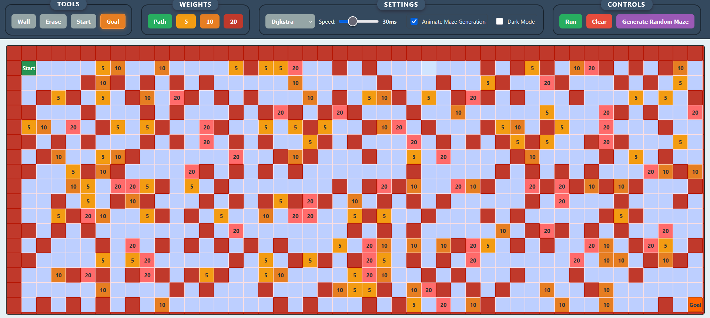
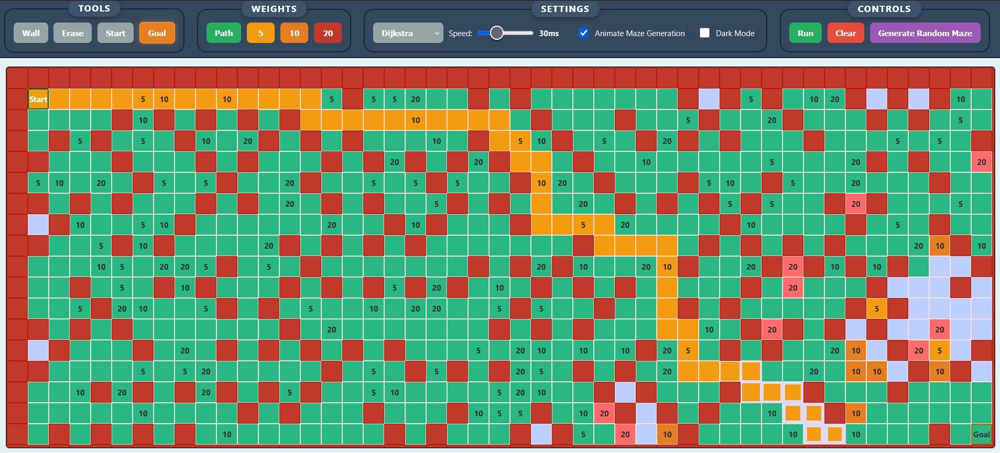

# Pathfinding Visualizer 📊<a>https://Mihay135.github.io/pathfinding-visualizer</a>

An interactive **pathfinding algorithm visualizer** built with **React** and **vanilla CSS**. <br/> Visualize how **Dijkstra, A\*, BFS, DFS, and Bidirectional BFS** explore a grid to find the shortest path from **Start** to **Goal**.

# Screenshots
| **App Initial View** |
|----------------|
| |
| **Automatic Maze Generation** |
|  | 
| **Path Found Animation To Goal** |
||
| **Dark Mode Supported** |
|  |

# Features ✨
- **5 Algorithms**: Dijkstra, A\*, BFS, DFS, Bidirectional BFS (choose from dropdown menu, Dijkstra's by default)
- **Interactive Grid**: Click & drag to draw walls, weights, start, and goal
- **Animated Maze Generation** (Kruskal’s Algorithm with Union-Find)
- **Random Weights** (5, 10, 20) on open paths
- **Responsive Design** (works on mobile & desktop)
- **Dark Mode Support** with glowing tool indicators
- **User Feedback**:
  - "No Path Found" overlay
  - "Place Start & Goal" warning
- **Smooth Animations** with speed control
- **Clear & Run Buttons** 

## Algorithms 🔲

| Algorithm         | Guaranteed Shortest? | Handles Weights? | Notes |
|-------------------|------------------------|------------------|-------|
| **Dijkstra**      | Yes                  | Yes            | Classic, reliable |
| **A\***           | Yes                  | Yes            | Uses heuristic |
| **BFS**           | Yes (unweighted)     | No             | Fast on uniform grids |
| **DFS**           | No                   | No             | May find long paths |
| **Bidirectional BFS** | Yes                  | No            | Searches from both ends |

## How to Use 📖

1. **Place Start** (green) and **Goal** (red) nodes
2. **Draw walls** or **weights** (5, 10, 20)
3. Choose an **algorithm** and **speed**
4. Click **Run** to watch the animation
5. Click **Generate Maze** for a random maze
6. Use **Clear** to reset
7. Use **Eraser** to erase any cell

> **Tip**: Drag to draw continuously. Click once to place Start/Goal.

## Tech Stack 🛠️

- **React** (functional components, hooks)
- **Javascript** (Pathing Algorithms)
- **CSS Grid** for responsive layout
- **Union-Find (DSU)** for maze generation
- **Custom Events** for button controls
- **No external libraries**

## Project Structure 🏠
```
... (build files, Node modules, git and package.json files)
src/
|-- App.js
|-- App.css
|-- index.js
|-- index.css
|-- PathfindingVisualizer/
|   |-- PathfindingVisualizer.jsx
|   |-- PathfindingVisualizer.css
|   |-- Grid/
|   |   |-- Grid.jsx       ← Main grid logic
|   |   |-- Grid.css
|   |-- Cell/
|   |   |-- Cell.jsx
|   |   |-- Cell.css
|   |-- Navbar/            ← Controls
|   |   |-- Navbar.jsx
|   |   |-- Navbar.css
|-- Algorithms/
|   |-- Astar.js
|   |-- BFS.js
|   |-- BidirectionalBfs.js
|   |-- DFS.js
|   |-- Dijkstra.js
... (other irrelevant files public folder etc..)
```
## Setup & Run Locally (clone repo)

```bash
git clone https://github.com/mihay135/pathfinding-visualizer.git
cd pathfinding-visualizer
npm install
npm start
```

## License 📜
MIT License (LICENSE) – free to use, modify, and distribute. (for more complete information see the LICENSE file)

Built with love ❤️ by Mihay135
Star 🌟 the repo if you like it!


